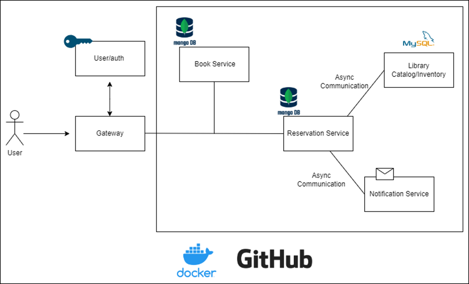

# Library management
Microservices Exam 

candidate: 2015

### Running application:
Running the docker-compose.yml file will start up 
- mysql
- mongodb
- consul
- rabbitmq

as docker containers, with correct environments as specified in the application.properties files. 
(if specified ports are not already occupied on the local machine)

after doing this. Run each individual application by either starting the application through the IDE GUI
or through command line:
for each module, open a new terminal in input these commands
```
    cd api-gateway
    mvn spring-boot:run
```

```
    cd book-service
    mvn spring-boot:run
```
```
    cd library-catalog
    mvn spring-boot:run
```
```
    cd reservation-service
    mvn spring-boot:run
```


I encountered a problem when building the docker files, since I had the modules inherit dependencies from the root module.
The problem i encountered was that the parent pom was not accessible. I then made the decision to comment them out from the 
docker-compose file and move on to other tasks.


### User Stories

## Services:

### API-Gateway

Uses Consul discovery and routes http calls to its port, to the correct services.


### Book Service

i was not able to fully implement migrations for the book service, so values has to be added manually.
to http://localhost:8080/api/books

```
    {
        "isbn": "9798579327079",
        "title": "Read People Like a Book",
        "author": "Patrick King",
        "genre": "Self-help book",
        "releaseYear": 2020,
        "description": "Speed read people, decipher body language, detect lies, and understand human nature."
    }
```
```
 {
    "isbn": "9781942788294",
    "title" : "The Phoenix Project",
    "author": "Gene Kim",
    "genre" : "Novel",
    "releaseYear" : 2013,
    "description": "a business novel that chronicles Bill, an IT manager's journey to revamp his struggling company's processes, using principles of DevOps"
}
```
```
 {
    "isbn": "9780399590863",
    "title" : "The 272",
    "author": "Rachel L. Swans",
    "genre" : "Biography",
    "releaseYear" : 2023,
    "description": "The story begins with Ann Joice, a free Black woman and the matriarch of the Mahoney family."
}
```

```
 {
    "isbn": "9781324001805",
    "title" : "The Iliad",
    "author": "Homer",
    "genre" : "Epos",
    "releaseYear" : 2023,
    "description": "The greatest literary landmark of classical antiquity masterfully rendered by the most celebrated translator of our time"
}
```


The book service features 2 endpoints

- **/api/books**: this endpoints has a get and post method. You can add new books to the database.
    this was meant for admin use. but i did not get to implement any user functionality. the Get method 
    returns list of all books.


- **/api/books/{value}**: this endpoint takes a string value as a path variable, and returns a list of books
where the string value is featured in either author, genre or title fields in the database.
it will also return if just a portion of field value is the same as the string, as it uses the "contains" query for search.

This service was originally meant to use rabbitmq to publish an event to the library catalog when adding a book
but i met with some problems and there was not enough time to implement it.


### Library Catalog

this service is somewhat of a inventory service. it features one endpoint which returns a CatalogResponse that contains
the isbn of the book which was to be reserved, and a boolean value, of whether the book is available or not for loan.

Original plan was to use RabbitMQ's RabbitListener to
listen for added books in the book-service, but i met some difficulties
implementing it, and was running out of time. therefore i had to hardcode some values.


### Reservation Service

This service features one endpoint:
- **/api/reservation** : this endpoint has only a post method that takes in a list as the request body
example of request body is

Isbn values that exist in the database are
```
{
   "reservationLineItemsDtoList":[{
        "isbn": "9781942788294",
        "quantity": 1
    }]
}
```
for reserving one book and:
```
{
   "reservationLineItemsDtoList":[{
        "isbn": "9781942788294",
        "quantity": 1
    },
    {
        "isbn": "9798579327079",
        "quantity": 1
        
    }]
}
```
for two books and so on.
for all books
```
 {
   "reservationLineItemsDtoList":[{
        "isbn": "9781942788294",
        "quantity": 1
    },
    {
        "isbn": "9798579327079",
        "quantity": 1
        
    },{
        "isbn": "9781324001805",
        "quantity": 1
    },
    {
        "isbn": "9780399590863",
        "quantity": 1
        
    }]
}
```

When this endpoint gets called it uses a Webclient to do a synchronous
call to the library catalog to check if books are 
available for loan, if so the order is successful and gets stored in the database.


### Architecture


i ended up using Synchronous communication between the library-catalog and reservation service
as it seemed more appropriate. I also ended up using MySql database for the reservation service
instead of mongodb.
the user-service and notification-service were sadly not implemented because of lack of time.